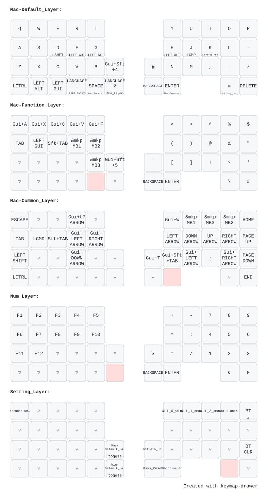
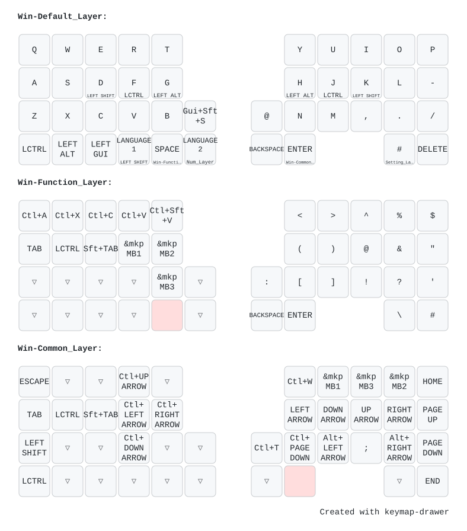

# zmk-config-AroundFortyRB

Around Forty RightBallのファームウェア。

AMLはOFF。

→ config/boards/shields/AroundForty-RB/AroundForty-RB_R.overlay　61行目

# Keymaps

## Mac (& NUM & settings)

## Windows

# 更新手順

1. [keymap-editor](https://nickcoutsos.github.io/keymap-editor/)で好きにいじる(repoは自分のを読ます)
2. [Save]をおしてcommitする
3. Actiosが終わったらLatestのファームウェアをDL＆解凍する
4. 右手側をPCとUSBで直接接続して&bootloaderを実行、ビルドしたファームウェアを配置する
5. [keymap-drawer](https://keymap-drawer.streamlit.app/) で.keymapを読ませてキーマップを更新する
