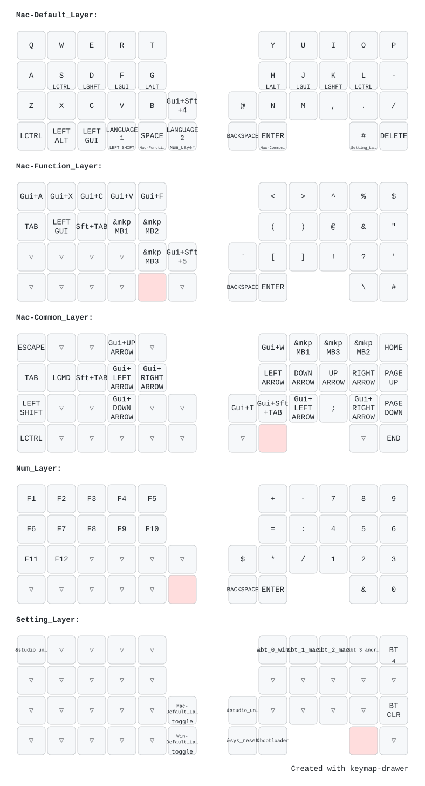
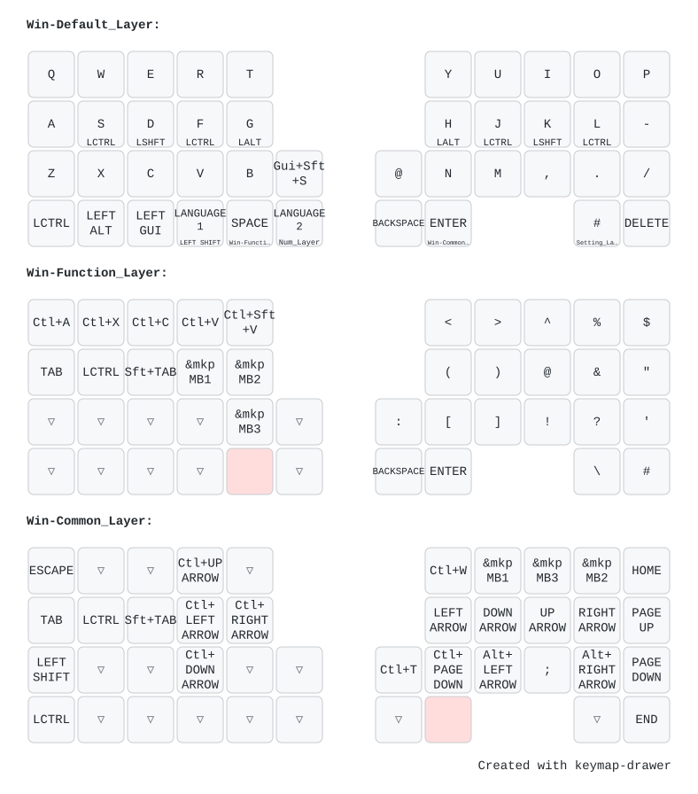

# zmk-config-AroundFortyRB

Around Forty RightBallのファームウェア。

AMLはOFF。

→ config/boards/shields/AroundForty-RB/AroundForty-RB_R.overlay　61行目

# Keymaps

## Mac (& NUM & settings)

## Windows

# 更新手順

ビルドは ZMK `v0.2-branch` を使用しています。互換性を維持するため、
`.github/workflows/build.yml` の再利用ワークフローと、`config/west.yml` の
`inorichi/zmk-pmw3610-driver` はコミット SHA に固定しています。
ワークフローは 2026-02-17 の成功時の版、ドライバーは既存の
`CONFIG_PMW3610_*` と `scroll-layers` に対応する版です。
これらを更新する際は、ZMK・ドライバー・シールド設定の互換性を合わせて確認してください。

1. [keymap-editor](https://nickcoutsos.github.io/keymap-editor/)で好きにいじる(repoは自分のを読ます)
2. [Save]をおしてcommitする
3. Actionsが終わると、連番のタグ（`v1`、`v2`、…）が付いた[Release](https://github.com/SKoji1117/zmk-config-AroundFortyRB/releases/latest)が自動で作られるので、そこからファームウェアをDLする（ビルドに関わるファイルが変わったときだけ走る）
4. 下の「uf2の適用手順」でファームウェアを書き込む
5. [keymap-drawer](https://keymap-drawer.streamlit.app/) で.keymapを読ませてキーマップを更新する

# uf2の適用手順

[Release](https://github.com/SKoji1117/zmk-config-AroundFortyRB/releases/latest) には次の3つが添付されています。

| ファイル | 書き込み先 |
| --- | --- |
| `AroundForty-RB_R.rgbled_adapter-seeeduino_xiao_ble-zmk.uf2` | 右手側（central、トラックボール側） |
| `AroundForty-RB_L.rgbled_adapter-seeeduino_xiao_ble-zmk.uf2` | 左手側（peripheral） |
| `settings_reset-seeeduino_xiao_ble-zmk.uf2` | 設定の初期化用（左右共通） |

ふだんは右手側に書き込むだけで足ります。キーマップは右手側が持っていて、左手側は押されたキーの位置を送るだけなので、キーマップの変更は左手側に何もしなくても反映されます。

左手側にも書き込むのは、左手側のファームウェア自体が変わるときだけです。

- `AroundForty-RB_L.conf`、`AroundForty-RB_L.overlay`、`AroundForty-RB.dtsi` を変えたとき
- `west.yml` で ZMK やモジュールの版を変えたとき（左右で版をそろえる）

## 右手側の書き込み（ふだんはこれだけ）

書き込むファイル: `AroundForty-RB_R.rgbled_adapter-seeeduino_xiao_ble-zmk.uf2`

1. 右手側の XIAO を PC と USB で直接つなぐ
2. Setting レイヤーの `&bootloader` を押して、ブートローダーモードに入れる（XIAO のリセットボタンをすばやく2回押してもよい）
3. `XIAO-SENSE` などの名前でドライブが現れるので、`AroundForty-RB_R.rgbled_adapter-seeeduino_xiao_ble-zmk.uf2` をコピーする
4. コピーが終わるとドライブが自動で外れて再起動する（「正しく取り出されませんでした」と出ても問題ない）

## 左手側の書き込み（必要なときだけ）

書き込むファイル: `AroundForty-RB_L.rgbled_adapter-seeeduino_xiao_ble-zmk.uf2`

1. 左手側の XIAO を PC と USB で直接つなぐ
2. XIAO のリセットボタンをすばやく2回押して、ブートローダーモードに入れる（`&bootloader` は押した側にしか効かず、キーが右手側にあるので使えない）
3. 現れたドライブに `AroundForty-RB_L.rgbled_adapter-seeeduino_xiao_ble-zmk.uf2` をコピーする
4. コピーが終わるとドライブが自動で外れて再起動する

左右のファイルを取り違えると、キーが反応しなくなります。その場合は正しいファイルを書き込み直せば戻ります。

## 左右がつながらなくなったとき

左右のペアリング情報が壊れると、左手側の入力が届かなくなります。そのときは設定を初期化します。

1. 左右それぞれに `settings_reset-seeeduino_xiao_ble-zmk.uf2` を書き込む（左右で同じファイル）
2. 右手側に `AroundForty-RB_R.rgbled_adapter-seeeduino_xiao_ble-zmk.uf2`、左手側に `AroundForty-RB_L.rgbled_adapter-seeeduino_xiao_ble-zmk.uf2` を書き込み直す
3. 左右の電源を同時に入れ直す
4. PC やスマホ側に残っている Bluetooth の登録を削除して、ペアリングし直す
